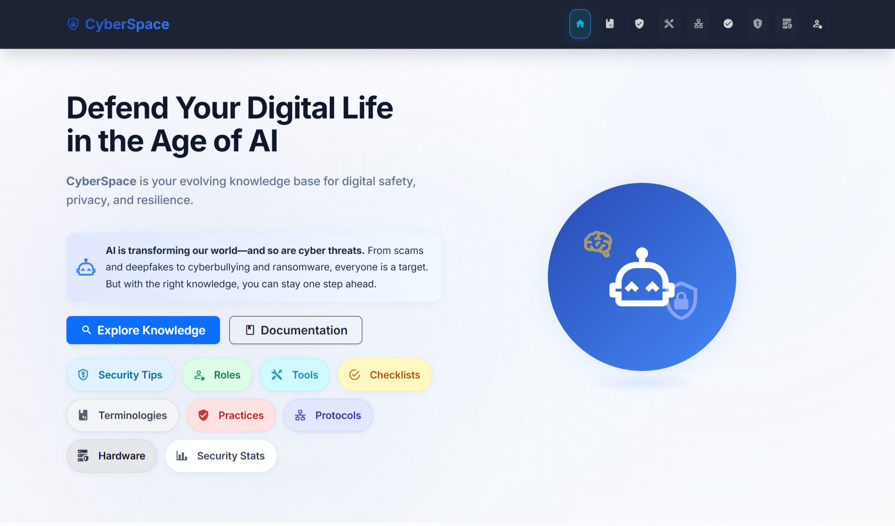
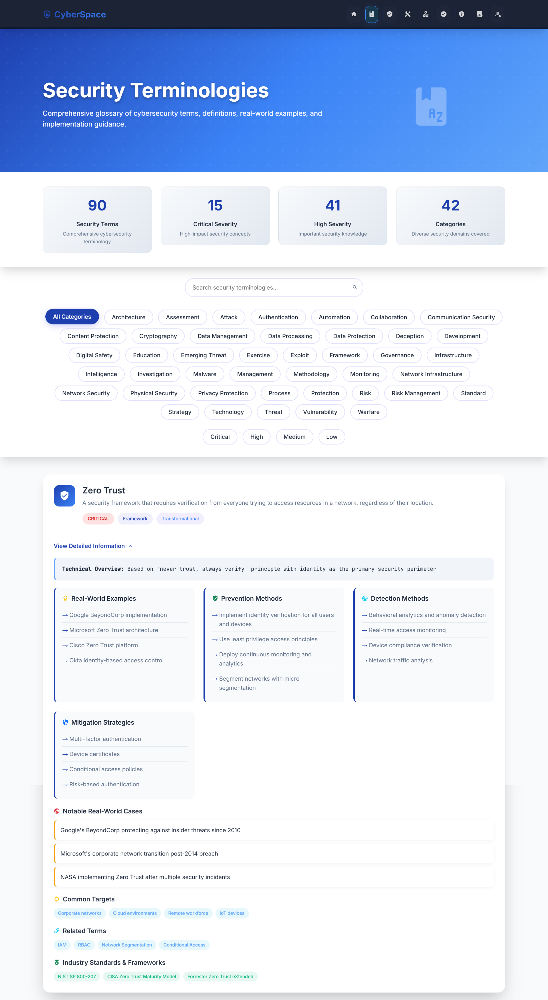
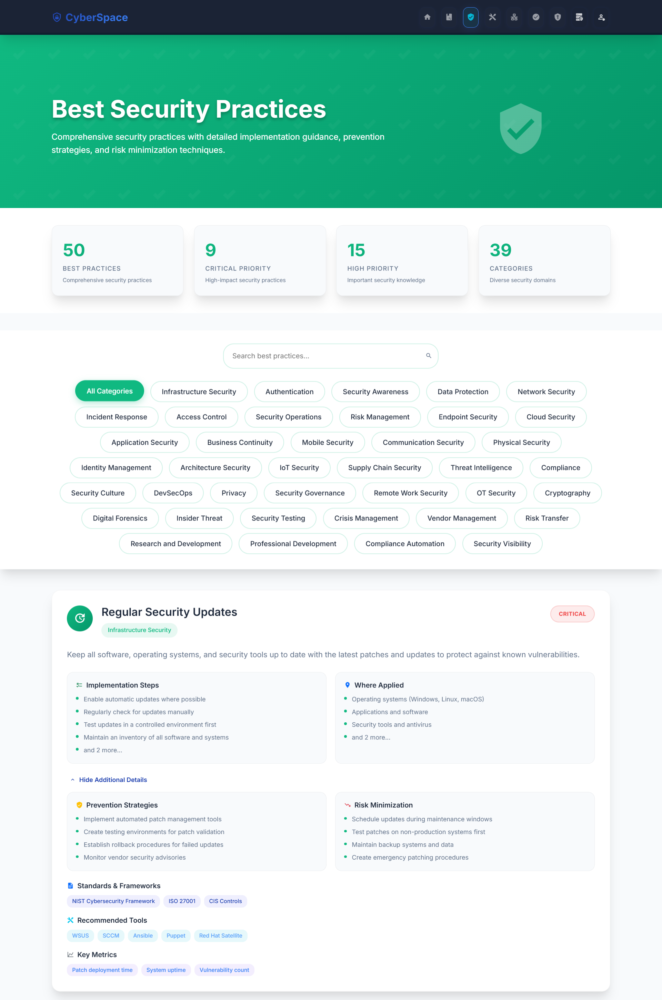
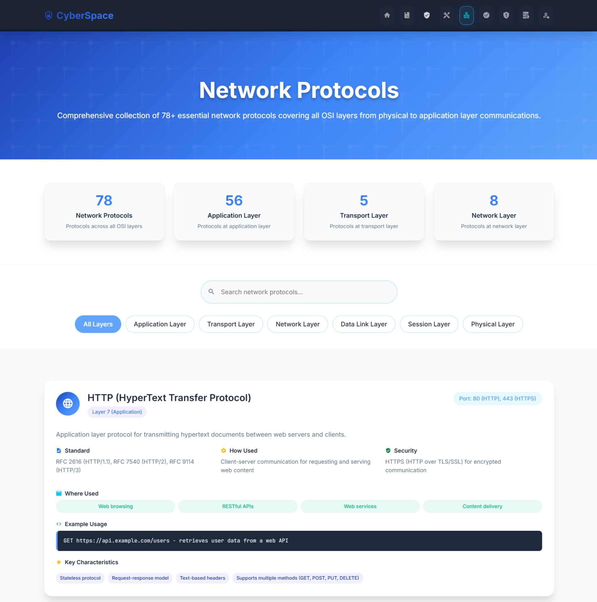
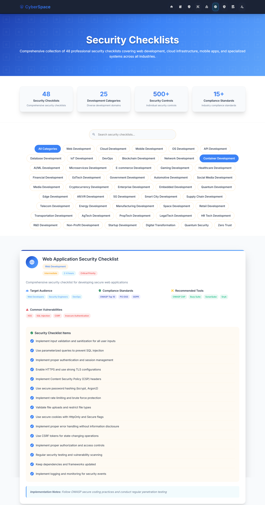
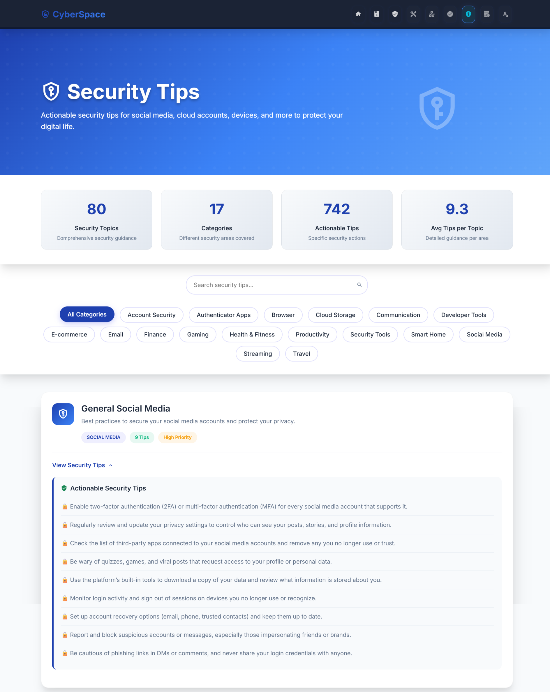
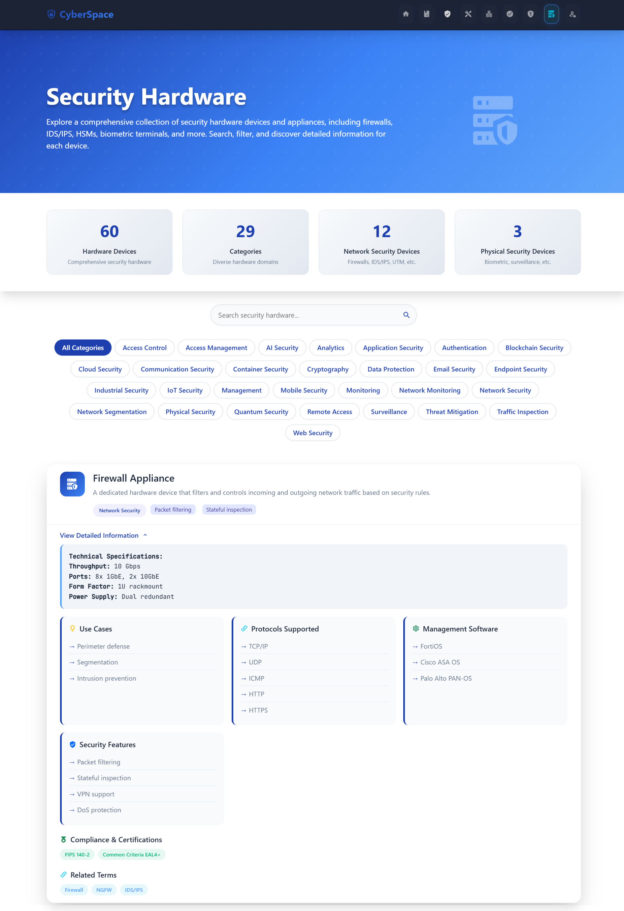
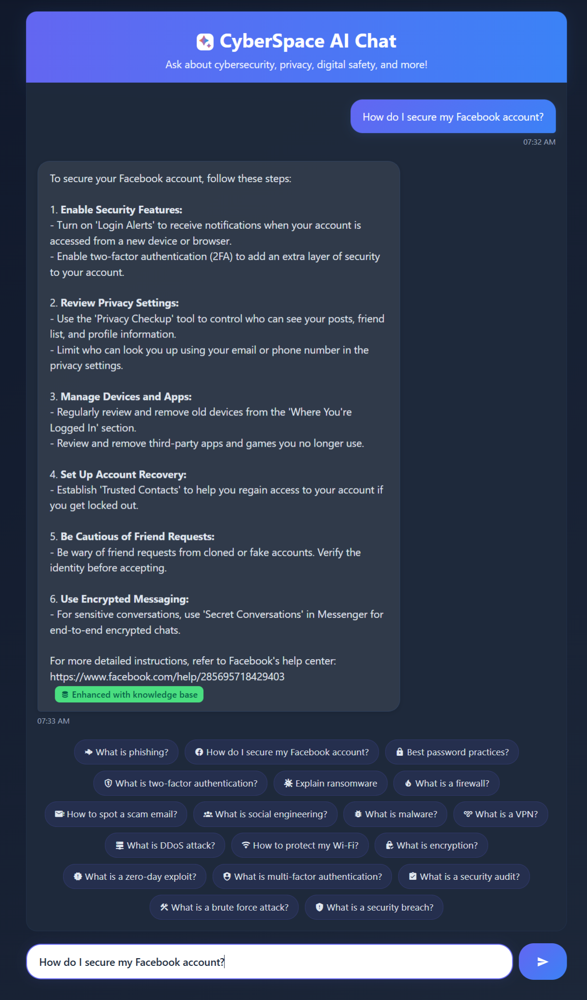

# 🛡️ CyberSpace - Cybersecurity Knowledge Hub

> **Defend Your Digital Life in the Age of AI**

CyberSpace is your evolving knowledge base for digital safety, privacy, and resilience. AI is transforming our world—and so are cyber threats. From scams and deepfakes to cyberbullying and ransomware, everyone is a target. But with the right knowledge, you can stay one step ahead.

## 📋 Table of Contents

- [About](#about)
- [Features](#features)
- [Tech Stack](#tech-stack)
- [Screenshots](#screenshots)
- [Future Enhancements](#future-enhancements)

## 🎯 About

CyberSpace is a comprehensive cybersecurity knowledge hub designed for tech professionals, students, and anyone interested in digital security. In today's AI-driven world, cyber threats are evolving rapidly, and staying informed is crucial for protecting your digital life.

### Why CyberSpace?

- **Comprehensive Knowledge Base**: 8,000+ entries across 8 cybersecurity categories
- **AI-Powered Learning**: Intelligent search and chat assistant powered by Mistral AI
- **Modern Interface**: Beautiful Material 3 design with responsive layout
- **Real-time Search**: Advanced vector search with semantic understanding
- **Open Source**: Free and accessible to everyone

### Target Audience

- **Tech Professionals**: Developers, IT administrators, security analysts
- **Students**: Computer science, cybersecurity, and IT students
- **Business Owners**: Entrepreneurs and small business owners
- **General Users**: Anyone concerned about digital security and privacy

## ✨ Features

### 📚 Knowledge Categories

| Category              | Description                                                                                      |
|----------------------|------------------------------------------------------------------------------------------------|
| Security Terminologies| Cybersecurity terms with detailed explanations, examples, and real-world cases                  |
| Best Practices        | Industry-standard security practices with implementation guides                                   |
| Security Tools        | Extensive collection of cybersecurity tools with features and use cases                          |
| Network Protocols     | Detailed guide to network protocols, standards, and implementation                              |
| Security Checklists   | Practical checklists for various security scenarios and compliance                              |
| Hardware Security     | Information about security hardware, devices, and physical security                             |
| Career Roles          | Comprehensive guide to cybersecurity career paths, skills, and salaries                         |
| Security Tips         | Daily security tips and best practices for personal and organizational security                 |

### 🤖 AI-Powered Features

- **Intelligent Search**: Advanced search across all content categories with related term suggestions
- **AI Chat Assistant**: Contextual cybersecurity guidance powered by Mistral AI
- **Vector Search**: Semantic search using FAISS for more accurate results
- **Knowledge Base Integration**: AI responses enhanced with relevant content

### 🎨 User Experience

- **Material 3 Design**: Modern, beautiful interface with cybersecurity-themed colors
- **Responsive Design**: Mobile-first approach for all devices
- **Smooth Animations**: Engaging animations using AOS library
- **Fast Performance**: Optimized loading with efficient search algorithms

### 🔧 Technical Features

- **RESTful API**: Complete API for integrating cybersecurity data
- **Real-time Search**: Instant search results with filtering and categorization
- **Data Export**: Easy access to all cybersecurity data through API endpoints
- **Scalable Architecture**: Built with Flask for reliability and easy deployment

## 🛠️ Tech Stack

| Category        | Technology                        | Purpose                                 |
|-----------------|------------------------------------|-----------------------------------------|
| Backend         | Python, Flask                     | Web framework and server-side logic      |
| Frontend        | HTML5, CSS3, JavaScript           | User interface and interactions         |
| CSS Framework   | Bootstrap 5                       | Responsive design and components        |
| AI/ML           | FAISS, Mistral AI                 | Vector search and natural language processing |
| Data Storage    | JSON, Pickle                      | Data serialization and storage          |
| API             | RESTful API                       | Data access and integration             |
| Search          | Vector Search, Semantic Search    | Advanced content discovery              |
| Design          | Material 3                        | Modern UI/UX design system              |

## 📸 Screenshots

### 1. Hero Section

*Welcome to CyberSpace - Your comprehensive cybersecurity knowledge hub*

### 2. Index Full Page

*Main dashboard with search functionality and category overview*

### 3. Security Terminologies

*Comprehensive cybersecurity terms and definitions with search and filtering*

### 4. Security Best Practices

*Industry-standard security practices with implementation guides*

### 5. Security Tools & Technologies

*Extensive collection of cybersecurity tools with features and use cases*

### 6. Network Protocols

*Detailed guide to network protocols, standards, and implementation*

### 7. Security Checklists

*Practical checklists for various security scenarios and compliance*

### 8. Security Tips

*Daily security tips and best practices for personal and organizational security*

### 9. Security Hardware

*Information about security hardware, devices, and physical security measures*

### 10. AI Cyber Chat

*AI-powered chat assistant for cybersecurity guidance and explanations*

## 🔮 Future Enhancements

Based on our documented roadmap, CyberSpace will evolve into an even more comprehensive cybersecurity ecosystem:

### 🔌 Unified Open-Source API
- Develop a comprehensive API for developers and researchers to integrate cybersecurity data
- Enable third-party applications to access our knowledge base
- Create SDKs and documentation for easy integration

### ⚖️ Cyber Laws & Frameworks
- Add comprehensive database of cybersecurity laws by country
- Include international cybersecurity frameworks and regulations
- Provide compliance guidance and legal reference materials

### 📊 Cyber Crime Statistics & Analytics
- Implement real-time cyber crime statistics and trends
- Create interactive visualizations and dashboards
- Provide threat intelligence and risk assessment tools

### 🌐 Global Threat Intelligence
- Integrate real-time threat intelligence feeds
- Add cybersecurity news and alerts from global sources
- Implement threat monitoring and notification systems

### 👥 Community Contributions
- Build community-driven content contribution system
- Implement expert Q&A platform for cybersecurity professionals
- Create user-generated content and knowledge sharing features

### 🔄 Continuous Data Updates
- Establish automated data update mechanisms
- Add new resource types and content categories
- Implement version control for knowledge base content

### 💡 Community-Driven Innovation
- Encourage user suggestions for new features and improvements
- Build feedback loops for continuous platform enhancement
- Foster collaboration with the cybersecurity community

---

**CyberSpace is not just a project; it's a vision for democratizing cybersecurity knowledge and making it accessible to everyone who wants to learn and grow in this critical field.**

⭐ **Star this repository if you find it helpful!**
